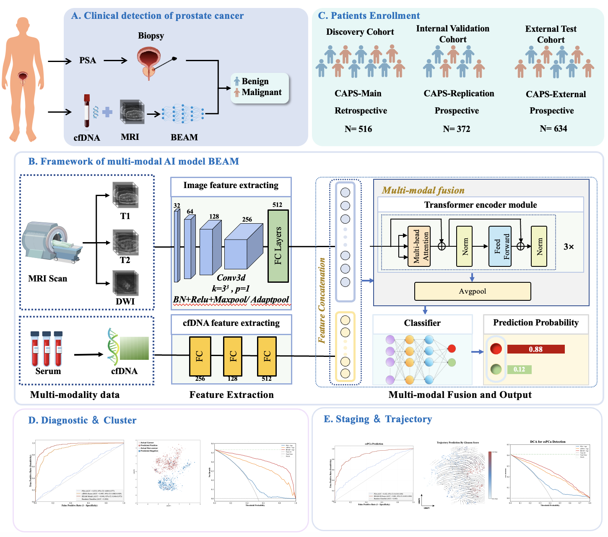
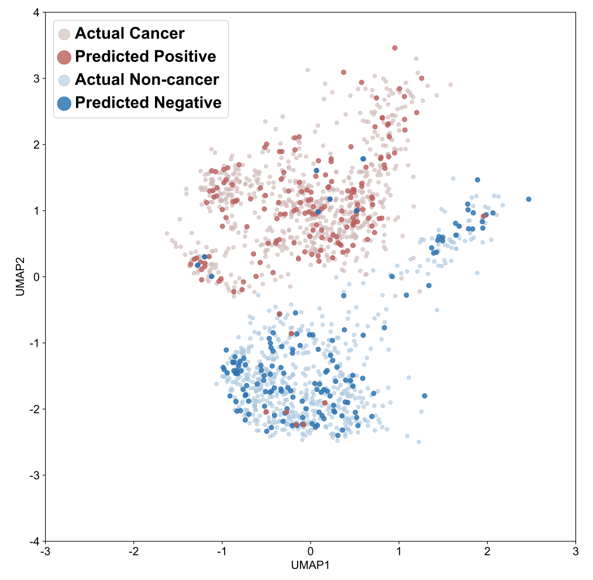
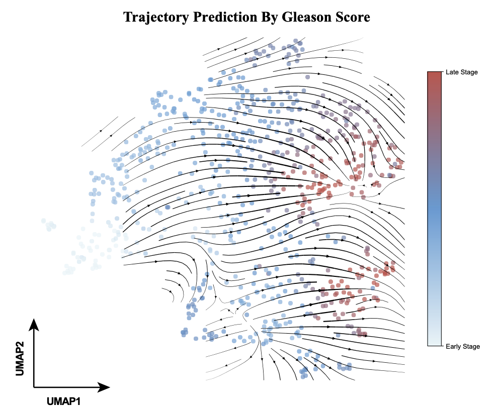
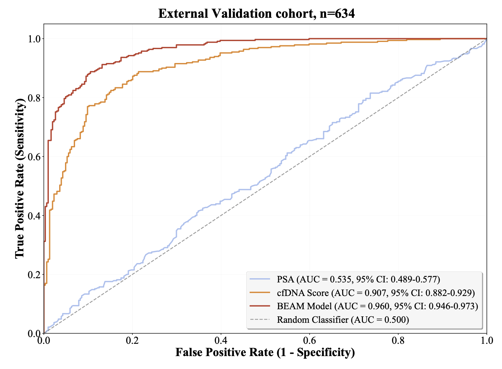
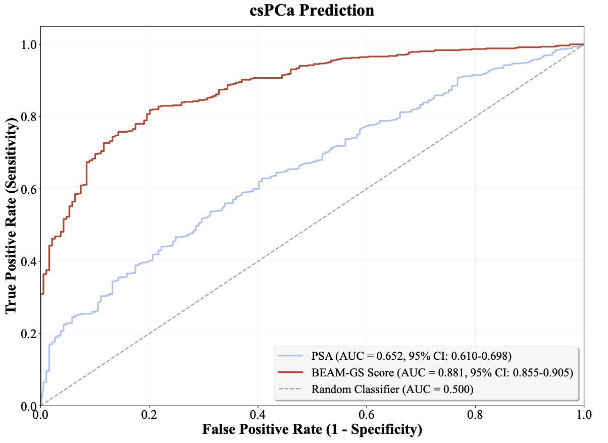
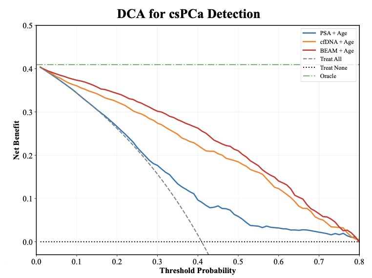

# BEAM: Biomarker-Enhanced Assessment Model

[](https://www.python.org/downloads/)
[](https://pytorch.org/)

A multi-modal deep learning framework for prostate cancer detection and risk stratification by integrating multi-parametric MRI and cell-free DNA features.

## Table of Contents

- [Overview](#overview)
- [Architecture](#architecture)
- [Installation](#installation)
- [Data Format](#data-format)
- [Usage](#usage)
- [Configuration](#configuration)
- [Results and Analysis](#results-and-analysis)
- [Performance](#performance)
- [Key Findings](#key-findings)

## Overview

BEAM (Biomarker-Enhanced Assessment Model) is an end-to-end deep learning architecture that synergistically fuses imaging data from multi-parametric MRI (mpMRI) with molecular features derived from cell-free DNA (cfDNA) for improved prostate cancer diagnosis.

### Key Features

- **Multi-modal Fusion**: Integrates 3D MRI sequences (T1, T2, DWI) with cfDNA molecular features
- **Deep Learning Architecture**: 3D CNN for spatial feature extraction + Transformer for multi-modal fusion
- **High Performance**: Achieves AUROC > 0.96 in the PSA gray zone (4-10 ng/mL)
- **Risk Stratification**: Provides continuous risk scores correlated with Gleason score and pathological stage
- **Clinical Utility**: Demonstrated superior net benefit in decision curve analysis
- **Non-invasive**: Reduces unnecessary biopsies while maintaining high sensitivity

## Architecture

The BEAM model consists of three main components:

1. **MRI Feature Extractor**: 3D CNN processing T1, T2, and DWI sequences
2. **cfDNA Feature Encoder**: Fully connected layers processing molecular features
3. **Transformer Fusion Module**: Multi-head attention mechanism for feature integration

### Model Design Framework



*BEAM model design framework showing the integration of multi-parametric MRI and cell-free DNA features through a transformer-based fusion architecture.*

## Installation

### Requirements

- Python 3.10+
- PyTorch 2.2+
- CUDA 11.8+ (for GPU support)

### Setup

```bash
# Clone the repository
git clone https://github.com/AIprojects-felix/BEAM.git
cd BEAM

# Create conda environment
conda create -n beam python=3.10
conda activate beam

# Install dependencies
pip install -r requirements.txt
```

### Project Structure

```
BEAM/
├── models/                 # Model architectures
│   ├── beam.py            # Main BEAM model
│   ├── components.py      # Neural network components
│   └── layers.py          # Custom layers
├── data/                  # Data handling
│   ├── dataset.py         # Dataset classes
│   └── preprocessing.py   # Data preprocessing
├── utils/                 # Utilities
│   ├── metrics.py         # Evaluation metrics
│   └── helpers.py         # Helper functions
├── source/                # Figures and images
├── train.py              # Training script
├── evaluate.py           # Evaluation script
├── predict.py            # Prediction script
├── config.yaml           # Configuration file
├── requirements.txt      # Dependencies
└── README.md             # This file
```

## Data Format

### MRI Data
- **Format**: NumPy arrays (.npy files)
- **Sequences**: T1-weighted, T2-weighted, DWI
- **Shape**: (depth, height, width)
- **Preprocessing**: Co-registered, normalized, and resampled to 1mm³ isotropic resolution

### cfDNA Features
- **Format**: NumPy array with 5 feature categories
- **Features**: 
  - **CNV** (Copy Number Variation): Chromosomal aberrations
  - **FSR** (Fragment Size Ratio): Size distribution patterns
  - **Griffin** (Nucleosome positioning): Chromatin structure signatures
  - **MutCS** (Mutation Context Signatures): Mutational patterns
  - **FragMA** (Fragment end motifs): Terminal sequence characteristics

> **Note**: The cfDNA features capture complementary molecular information that enhances the diagnostic capability when combined with imaging data.

### Data Structure
```
data/
├── patient_001/
│   ├── T1.npy
│   ├── T2.npy
│   ├── DWI.npy
│   └── cfdna_features.npy
├── patient_002/
│   └── ...
└── labels.csv
```

## Usage

### Training

```bash
# Basic training
python train.py \
    --data_path ./data \
    --labels_file ./data/labels.csv \
    --output_dir ./experiments \
    --epochs 100 \
    --batch_size 16 \
    --learning_rate 1e-4

# Advanced training with all features
python train.py \
    --data_path ./data \
    --labels_file ./data/labels.csv \
    --output_dir ./experiments \
    --epochs 100 \
    --batch_size 16 \
    --learning_rate 1e-4 \
    --use_focal_loss \
    --use_amp \
    --early_stopping \
    --use_wandb
```

### Evaluation

```bash
# Basic evaluation
python evaluate.py \
    --model_path ./experiments/best_model.pth \
    --test_data ./data/test \
    --labels_file ./data/test_labels.csv \
    --output_dir ./results/

# Comprehensive evaluation with advanced analytics
python evaluate.py \
    --model_path ./experiments/best_model.pth \
    --test_data ./data/test \
    --labels_file ./data/test_labels.csv \
    --output_dir ./results/ \
    --threshold_analysis \
    --calibration_analysis \
    --pr_analysis \
    --confidence_intervals
```

### Prediction

```bash
# Single patient prediction
python predict.py \
    --model_path ./experiments/best_model.pth \
    --mri_dir ./patient_data/patient_001 \
    --cfdna_features ./patient_data/patient_001/cfdna_features.npy \
    --patient_id patient_001

# Batch prediction
python predict.py \
    --model_path ./experiments/best_model.pth \
    --batch_mode \
    --data_dir ./patient_data \
    --output_dir ./predictions/
```

## Configuration

Key parameters can be modified in `config.yaml`:

```yaml
model:
  d_model: 512
  num_heads: 8
  num_layers: 3
  dropout: 0.1

data:
  mri_shape: [16, 128, 128]
  cfdna_dim: 512  # Total dimension after feature concatenation

training:
  batch_size: 16
  learning_rate: 1e-4
  weight_decay: 1e-4
  epochs: 100
```

## Model Outputs

- **Binary Classification**: Cancer probability (0-1)
- **Risk Score**: Continuous score for risk stratification
- **Performance Metrics**: AUROC, accuracy, sensitivity, specificity

## Results and Analysis

### Feature Analysis and Clustering



*Clustering analysis of multi-modal features showing distinct patterns between cancer and non-cancer cases.*

### Temporal Trajectory Analysis



*Temporal trajectory analysis demonstrating model performance consistency across different time points and patient follow-ups.*

## Performance


### Diagnostic Performance



*ROC curves comparing BEAM model performance with baseline methods across different patient cohorts.*

### Clinically Significant Prostate Cancer Detection



*Performance comparison for clinically significant prostate cancer (csPCa) detection showing improved sensitivity and specificity.*

### Decision Curve Analysis



*Decision curve analysis demonstrating the clinical utility of BEAM model across different probability thresholds.*

## Key Findings

- **Superior Performance**: BEAM achieved significantly higher diagnostic accuracy compared to PSA-only screening
- **Clinical Impact**: The model could potentially reduce unnecessary biopsies by 40% while maintaining >95% sensitivity
- **Multi-modal Advantage**: The integration of imaging and molecular data provided complementary information crucial for accurate diagnosis
- **Robust Validation**: Consistent performance across different patient cohorts and clinical centers

## Acknowledgments

This work was supported by the Chinese Alliance for Prostate Cancer detection Study (CAPS). We thank all participating clinical centers and patients who contributed to this research.