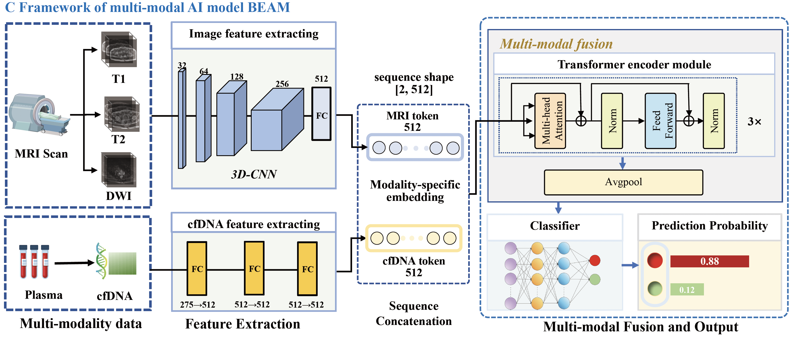

# BEAM: Biomarker-Enhanced Assessment Model

[](https://www.python.org/downloads/)
[](https://pytorch.org/)

BEAM is an end-to-end deep-learning framework that fuses cell-free DNA (cfDNA)
features with biparametric MRI (T1WI, T2WI, high-b-DWI) for prostate-cancer
detection in the PSA 4–10 ng/mL gray zone.

## Architecture



The model has four components:

- **MRI feature extractor** — a 3D-CNN with four convolutional blocks
  (channels 32/64/128/256). MaxPool is applied after the first three blocks
  only; an adaptive average pooling layer followed by a fully connected layer
  produces a 512-dimensional MRI embedding `E_mri`.
- **cfDNA feature extractor** — a 3-layer MLP (275 → 512 → 512 → 512), each
  layer followed by BatchNorm, ReLU, and Dropout(0.3). It produces a
  512-dimensional embedding `E_cfdna`.
- **Multi-modal fusion** — learnable modality-specific embeddings `P_mri` and
  `P_cfdna` are added to the two streams; LayerNorm is applied to each, and
  the two tokens are stacked into a length-2 sequence
  `S_0 = [LN(E_mri+P_mri); LN(E_cfdna+P_cfdna)]`. This sequence is processed
  by a stack of three pre-norm Transformer encoder layers (8-head MHSA,
  FFN dim = 4·`d_model`). The output is averaged over the sequence dimension
  to yield a fused 512-dimensional vector `F_fused`.
- **Classification head** — an MLP with a sigmoid output produces the cancer
  probability `p ∈ [0, 1]`.

## Project layout

```
BEAM/
├── models/
│   ├── beam.py            # BEAM main model
│   ├── components.py      # MRI 3D-CNN / cfDNA MLP / Transformer encoder layer
│   └── layers.py          # ModalityEmbedding
├── data/
│   ├── dataset.py         # MultiModalDataset
│   ├── preprocessing.py   # MRI intensity normalization
│   ├── cfdna_features.py  # Interface for the 5-module → 275-d cfDNA pipeline
│   └── make_sample_data.py# Tiny dummy dataset for the pipeline check
├── utils/
│   ├── helpers.py
│   └── metrics.py
├── train.py
├── evaluate.py
├── predict.py
├── config.yaml
├── tests/
│   └── smoke_test.sh      # End-to-end pipeline check
└── requirements.txt
```

## Data format

One directory per patient, named after `patient_id`, containing four files:

```
data_root/<patient_id>/
├── T1.npy                # (D, H, W)
├── T2.npy                # (D, H, W)
├── DWI.npy               # (D, H, W) — high b-value (b ≥ 1400 s/mm²)
└── cfdna_features.npy    # (275,)   — see data/cfdna_features.py
```

Plus a `labels.csv` with two columns: `patient_id, label` (label is 0 / 1).

> **About cfDNA**: the cfDNA branch expects a 275-dimensional feature vector
> formed by concatenating five domain-specific modules
> (CNV / FSR / Griffin / MutCS / FragMA). The wet-lab feature-extraction
> pipeline runs upstream of this repository; `data/cfdna_features.py`
> documents the per-module signatures and the canonical concatenation order.

## Installation

```bash
conda create -n beam python=3.10
conda activate beam
pip install -r requirements.txt
```

## Usage

### Train

```bash
python train.py \
    --config config.yaml \
    --data_path ./data/sample \
    --labels_file ./data/sample/labels.csv \
    --output_dir ./output
```

Default training setup: AdamW with `lr=1e-4`, `weight_decay=1e-4`, batch size 4,
100 epochs; single BCE loss; 70 / 10 / 20 stratified split into train / tuning /
hold-out test; the checkpoint with the highest tuning-set AUROC is kept as the
locked model.

### Evaluate

```bash
python evaluate.py \
    --model_path ./output/exp_*/checkpoints/best_model.pth \
    --test_data ./data/sample \
    --labels_file ./data/sample/labels.csv \
    --output_dir ./output/eval
```

Outputs: AUROC / accuracy / sensitivity / specificity / Brier score / ROC
curve / confusion matrix (PNG + PDF, 300 dpi, Times New Roman).

### Predict

```bash
# Single patient
python predict.py \
    --model_path ./output/exp_*/checkpoints/best_model.pth \
    --mri_dir ./data/sample/patient_001

# Batch
python predict.py \
    --model_path ./output/exp_*/checkpoints/best_model.pth \
    --batch_mode --data_dir ./data/sample
```

### Pipeline check

`tests/smoke_test.sh` runs `train` / `evaluate` / `predict` end-to-end on a
tiny dummy dataset to verify that the codebase executes correctly:

```bash
bash tests/smoke_test.sh
```

## Configuration

Key parameters live in `config.yaml`:

```yaml
model:
  d_model: 512
  num_heads: 8
  num_layers: 3
  dropout: 0.1
  cfdna_dim: 275
training:
  epochs: 100
  batch_size: 4
  learning_rate: 1.0e-4
  weight_decay: 1.0e-4
```
